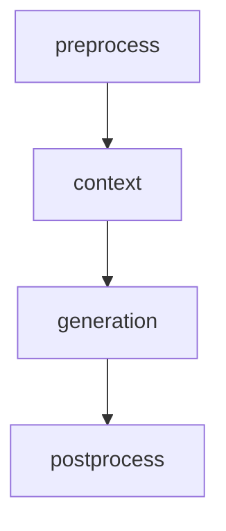
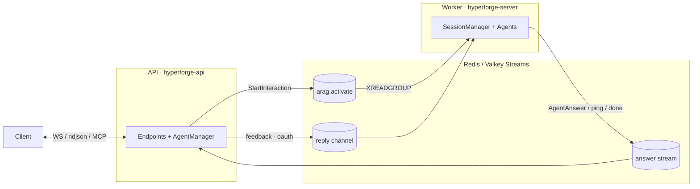
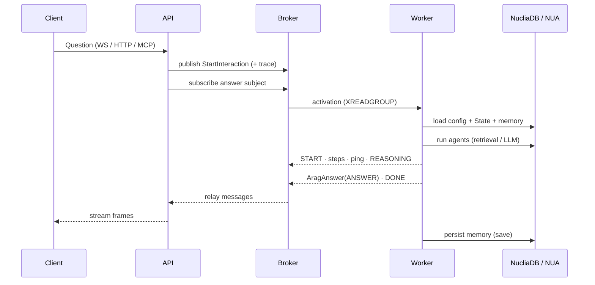
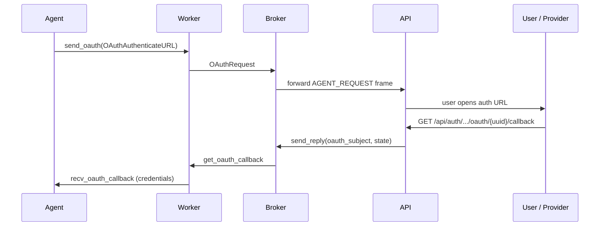
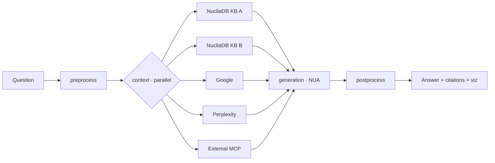
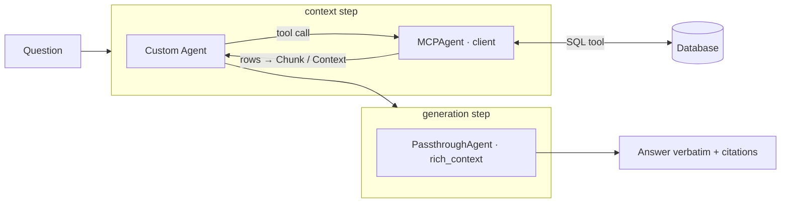

# Hyperforge

## Agentic Runtime

API ⇄ Worker · WebSocket & MCP · Smart / Restricted / NucliaDB / Search agents · Memory · NUA · OAuth

Press <kbd>space</kbd> to advance

---
layout: two-cols-header
---

# What is Hyperforge?

A Python monorepo (`uv`) implementing an **agentic framework/runtime** on top of NucliaDB.

::left::

## Core building blocks

- **Agents** self-register through a decorator registry (`@agent`, `@driver`)
- **Drivers** = connected data sources (NucliaDB KBs, Google, Perplexity, MCP, HTTP…)
- **Workflows** = named "use cases", each with its own pipeline & parameters
- **Retrieval experience** = ordered pipeline of stages

::right::

## Retrieval pipeline stages

`RetrievalAgentConfig` orchestrates
`preprocess → context → generation → postprocess`
with `drivers`, `rules`, `memory`, `workflow`.

---
layout: default
---

# Two Services, One Broker

API and Worker deploy independently and **never call each other directly** — they talk over a **Redis/Valkey Stream broker**.

---
layout: two-cols-header
---

# The Message Contract

`hyperforge/src/hyperforge/pubsub.py`

::left::

## API → Worker

- **`StartInteraction`** (`op:"start"`)
  account, agent_id, session, question, headers, arguments, chat_history, workflow_id, streaming
- **`QuitRequest`** — stop a running interaction

## Broker abstraction

- `broker/redis.py` — Redis **Streams** (`XADD` / `XREADGROUP`), consumer group `arag_server`
- `broker/local.py` — in-process queues for **standalone** mode (no Redis)

::right::

## Worker → API (`AgentMessage`)

Discriminated union on `op`:

| op              | message                      |
| --------------- | ---------------------------- |
| `ping`          | `AgentPing` (keepalive)      |
| `answer`        | `AgentAnswer` → `AragAnswer` |
| `done`          | `AgentDone`                  |
| `oauth`         | `OAuthRequest`               |
| `agent_request` | `AgentToUserRequest`         |
| `user_response` | `UserToAgentInteraction`     |

Subjects are templated per interaction:
`arag.{account}.{agent_id}.{workflow_id}.{session}.{question}.answer`

---
layout: default
---

# End-to-End Interaction Flow

---
layout: two-cols-header
---

# WebSocket Protocol

`api/v1/interaction.py` — `/api/v1/agent/{agent_id}/session/{session}/ws`
(+ workflow-scoped variant). Guarded by role `MEMBER`.

::left::

## Client → Server

State machine `Expecting`: QUESTION | FEEDBACK | NOTHING

- **Question** = `InteractionRequest`
  `{question, headers, arguments, chat_history, streaming}`
- **Feedback** = `UserToAgentInteraction`
  `{op:"user_response", request_id, response}`

`keep_open` query param → multiple questions per socket.

::right::

## Server → Client = `AragAnswer`

`operation` field (`AnswerOperation`):

| #   | op            | meaning             |
| --- | ------------- | ------------------- |
| 2   | START         | run started         |
| 0   | ANSWER        | full answer         |
| 6   | ANSWER_CHUNK  | token stream        |
| 7   | REASONING     | reasoning trace     |
| 5   | AGENT_REQUEST | elicitation / oauth |
| 3   | DONE          | finished            |
| 4   | ERROR         | failure             |

Carries `answer`, `step`, `context`, `citations`, `feedback`, `oauth`, `data_visualizations`…

---
layout: default
---

# Non-WebSocket Alternatives

::: block

## Streaming HTTP

`POST /api/v1/agent/{agent_id}/session/{session}` → `application/x-ndjson`

Same `stream_response` generator as WS.
No OAuth / elicitation (needs a bidirectional channel).

:::

The WebSocket is the **interactive** channel — it's the only transport that supports the full **feedback/elicitation** and **OAuth** round-trips, because those require the server to ask the client a question mid-run.

---
layout: two-cols-header
---

# Hyperforge as an MCP **Server**

`api/v1/mcp_interaction.py` — exposes agents *as* MCP tools.
`GET/POST/DELETE /api/v1/agent/{agent_id}/session/{session}/mcp`

::left::

## Mapping

- Uses official SDK `StreamableHTTPServerTransport` (**stateless**, JSON responses)
- Each agent **workflow** → an MCP **`Tool`**
  (name/description/`inputSchema` from workflow parameters)
- Agent **prompts** → MCP prompts (`list_prompts` / `get_prompt`)
- `call_tool` → runs `stream_response(workflow_id=…)`

::right::

## Content conversion

`convert_arag_answer_to_content`:

- text answers
- `EmbeddedResource` — citations, chunks, structured, json
- `ImageContent`
- Vega-Lite visualizations
  (`application/vnd.vegalite.v5+json`)

Elicitation (feedback) is bridged to
`mcp_session.elicit_form`.

Standalone deployments mount the same router.

---
layout: two-cols-header
---

# Hyperforge as an MCP **Client**

`agents/mcp` — `MCPAgent` (`@agent(id="mcp")`, context agent) connects **out** to external MCP servers.

::left::

## Transports & lifecycle

- **STDIO** (`MCPStdioDriver`) & **HTTP** (`MCPHTTPDriver`, streamable HTTP)
- Fresh `ClientSession` **per call** (reconnect model)
- Callbacks wired: `sampling` → NUA LLM, `elicitation` → Hyperforge `Feedback`, `list_roots`, logging, progress

::right::

## Discovery & calling

- `preload()` lists remote tools/prompts (paginated) and **dynamically registers** them as callable functions
- `expose_prompts_as_tools` → prompts callable as tools
- `process_tool()` converts remote content blocks → `Chunk` / `Context` with **size budgets**
- `MultiMCPAgent` aggregates & routes across several servers

`valid_headers` forwards selected client headers (passthrough).

---
layout: default
---

# The Agents (1/2)

::: grid grid-cols-2 gap-4

## Smart Agent
`agents/smart` · `ContextAgent`

Orchestrates registered sub-agents; each sub-agent's published functions become LLM tools.

- **`reactive`** — iterative tool-calling loop (`task_complete` / `user_feedback`)
- **`plan_execute`** — a planner LLM drafts steps, an executor LLM runs tools

Skips repeated identical calls, budgets results, surfaces feedback elicitations.

## Restricted Python Agent
`agents/restricted` · `PythonAgent`

Runs user Python in **`RestrictedPython`** (`safe_builtins`, `__import__` limited to `math`).

- Untrusted code runs in a **separate process** over a pipe
- Per-function `agent_id` authorization
- **1s CPU budget** per RAO call (killed on overrun)
- `sandbox_verify` blocks access to K8s API / nuclia.com
- Own service: `hyperforge-sandbox`

:::

---
layout: default
---

# The Agents (2/2)

::: grid grid-cols-2 gap-4

## NucliaDB Agents
`agents/nucliadb`

- **`AskAgent`** — advanced KB Ask: `search_by_title`, `ask_analysis_query`, `ask_agent`
- Builds `FindRequest`s: semantic (vectorset + MinScore), **graph relations**, keyword
- `RequestSecurity(groups=…)` for row-level security
- `choose_source` across multiple KBs
- **`SyncAskAgent`** — answers over synced third-party resources, OAuth per connection

## Internet Search Agents

- **`GoogleAgent`** (`agents/google`)
  `google.genai` + `GoogleSearch` grounding;
  resolves grounded chunks & redirect URLs;
  `internet_search`
- **`PerplexitySearchAgent`**
  `search.create(...)` with domain filter / max results

Both record `ExternalUsage` for consumption tracking and plug into `SmartAgent` as tools.

:::

---
layout: two-cols-header
---

# Memory Storage on NucliaDB

`hyperforge/src/hyperforge/memory/memory.py`

::left::

## Session = a NucliaDB **Resource**

- Q&A history → conversation field `qas`
- info / context / steps / user_info → text fields
- Three `NucliaDBAsync` clients (reader / writer / search)
- `search_in_questions` → semantic + keyword `FindRequest` over history
- History reads cached via `CachedSessionQA`

::right::

## Memory flavours

- `SessionMemory` — NucliaDB-backed (persistent)
- `EphemeralSessionMemory` — Valkey / no-op
- `NoMemorySessionMemory`

`QuestionMemory` is the agent-facing API:
`add_step`, `add_answer`, `save_context`,
`emit_streaming_chunk`, plus interaction
callbacks `send_feedback` / `send_oauth`.

`SessionManager.answer()` calls `question_memory.save()` and fires a `memory_saved` hook.

---
layout: two-cols-header
---

# NUA Connection — LLM & Embeddings

The **Nuclia Understanding API** is the single backend for all LLM + embedding capability.

::left::

## Wiring

- `llm.py::NUAConnection` validates a NUA key → `AsyncNuaClient(token, account, region)`
- `engine.py::get_state` picks a backend by priority:
  1. **internal NUA** (in-cluster predict service)
  2. local OpenAI model class
  3. **external NUA API key**
  4. no-op

::right::

## `Manager` façade over NUA

- `generate` / `execute` / `execute_json` / `execute_json_citation`
- `execute_stream` — token streaming → `emit_streaming_chunk`
- `rephrase`, `rerank`, **`remi`** (answer/context eval)
- `tokens_predict`, **`query_predict`** (embeddings)
- Consumption from `resp.consumption.normalized_tokens`
- Injects `x-origin: RAO`, tracking headers per request

**Any LLM / embedding model** is reached through NUA — no direct provider keys in the runtime.

---
layout: default
---

# OAuth — Third-Party Authentication

Agents can request user credentials mid-run over the **same feedback channel**.

Providers: **Google**, **Azure** (OAuth + certificate creds), **AWS S3 keys**, **ShareFile**, **MCP OAuth**. Used by `SyncAskAgent` for third-party connectors.

---
layout: two-cols-header
---

# Third-Party MCP Authorization

Two directions of MCP auth.

::left::

## (a) Our MCP server, protected

`api/v1/mcp_interaction.py` + `standalone/oauth.py`

- **RFC 9728** discovery: `/.well-known/oauth-protected-resource`
- `StandaloneAuthBackend` → `validate_mcp_bearer`:
  manual **JWT** verify (RS256/384/512), JWKS fetch + cache, issuer/aud/exp claims, scope/role checks
- 401 + `WWW-Authenticate: Bearer resource_metadata="…"`

::right::

## (b) Our MCP client, authorizing out

`agents/mcp/http.py`

- Full **PKCE authorization-code** flow
- SDK `state` replaced by a **Fernet-encrypted routing token** (`MCPOAuthRoutingParams`) so a fixed callback `/api/auth/mcp/callback` can route the code back over the broker
- `FeedbackTokenStorage` negotiates bearer tokens with the WS client (cached, else start OAuth)

---
layout: default
---

# MCP with Passthrough

Two "passthrough" notions that combine end-to-end.

::: grid grid-cols-2 gap-4

## Header / credential passthrough

- `MCPAgent` forwards selected client headers (`valid_headers`, copied from `memory.headers`)
- OAuth bearer tokens negotiated with the WS client are passed through to the external server
- The MCP-server handler preserves `authorization` when building the interaction

## Passthrough generation agent

`agents/passthrough` · `PassthroughAgent`
(`agent_type="generation"`, `__root_agent__`)

- Returns retrieved context **directly** — **no LLM call**
- `rich_context=True` emits chunks, structured text, images, image URLs
- Faithfully converted by `convert_arag_answer_to_content`

:::

Workflow's retrieved context → straight through → MCP tool caller = <b>MCP with passthrough</b>

---
layout: default
---

# Use Cases — Connecting Multiple Sources

A **retrieval experience** declares multiple **drivers** (sources) and context agents, fanned out in parallel.

**Use cases = named workflows** — each agent hosts many workflows, each with its own parameters, rules & pipeline, and each exposed as an MCP tool.

---
layout: two-cols-header
---

# Use Case — Database via MCP → Passthrough

Query a **database** exposed through an **MCP server**, shape results with a **custom context agent**, and return them **verbatim** — no LLM at generation.

::left::

::right::

## How it's wired

- **Driver** — `MCPHTTPDriver` / `MCPStdioDriver` → DB's MCP server
- **Context** — **custom agent** calls the MCP tool (`preload` finds `run_sql`), rows → `Chunk` / `Context`
- **Generation** — `PassthroughAgent` (`rich_context`) emits rows **verbatim**, no LLM call
- **Auth** — header / bearer **passthrough** (`valid_headers`, MCP OAuth)

---
layout: center
class: text-center
---

# Summary

**Decoupled** API ⇄ Worker over a Redis Stream broker

**WebSocket** (interactive) · **ndjson** (streaming) · **MCP** (server & client)

Agents: **Smart** · **Restricted Python** · **NucliaDB** · **Google / Perplexity** · **Passthrough**

Persistent **memory on NucliaDB** · all LLM & embeddings via **NUA**

**OAuth** third-party auth · **third-party MCP** authorization · **passthrough**

Hyperforge — an agentic runtime on top of NucliaDB

